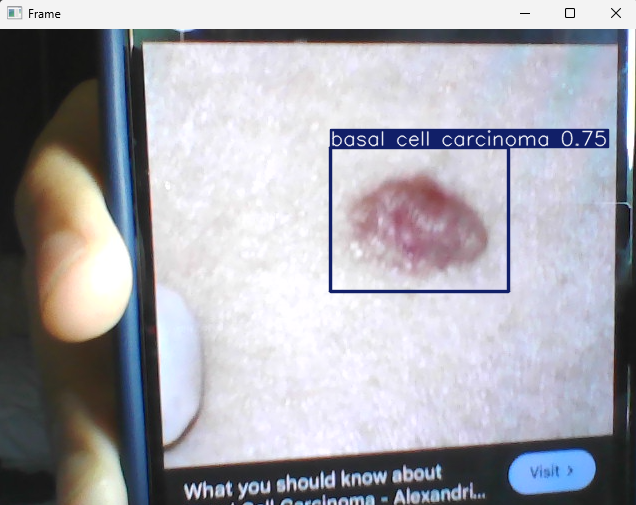
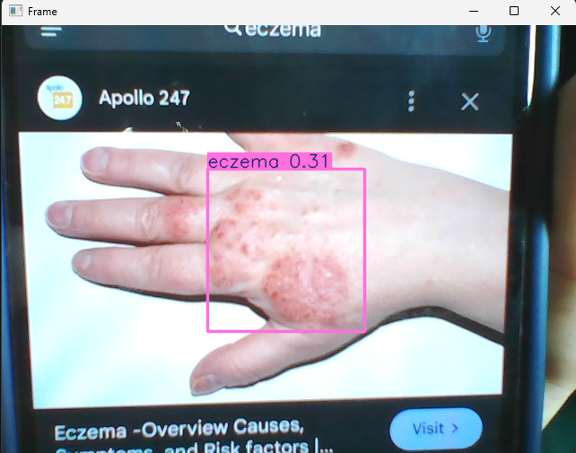
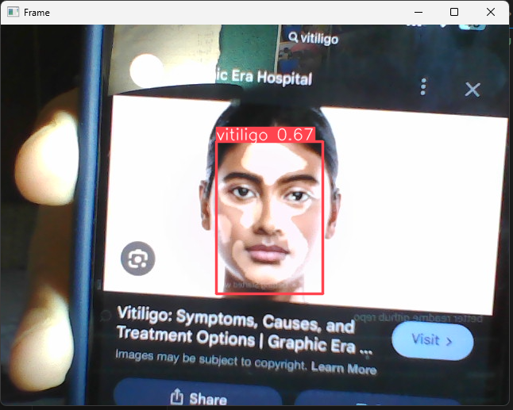
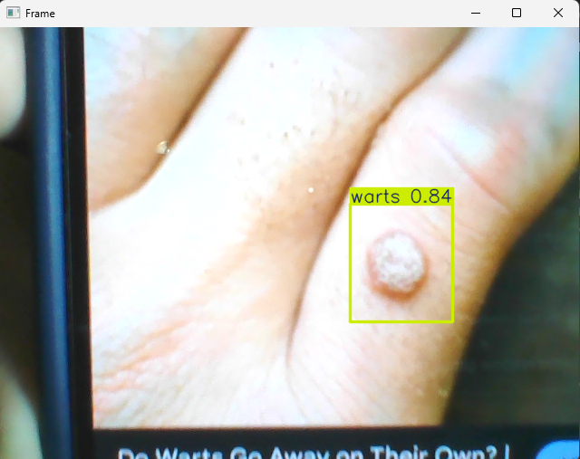

# Skin Diseases Detection

A machine learning project to detect skin diseases through computer vision using Roboflow, OpenCV, YOLO and Python

## Feature

* Detect skin diseases through your webcam
* Real time detection

## Example Output
Here are sample output from the detection 






## Machine Learning Model
This is the model that I have trained in this program
* Skin Diseases
* Acne
* Obesity
* Mask

## Getting Started
### Prerequisites
* Python 3.1 or higher
* VS Code with the [Python extension](https://marketplace.visualstudio.com/items?itemName=ms-python.python)  
* VS Code [Jupyter extension](https://marketplace.visualstudio.com/items?itemName=ms-toolsai.jupyter)  (If you want to train model)

### Installation
1. Clone the repository (in the terminal of your ide)

```py
https://github.com/haiqalhasly/skin-disease-training.git
```
3. Create a virtual environment

```py
  python -m venv venv
```
5. Activate the virtual environment
   * On windows
    ```py
    venv\Scripts\activate
    ```

   * On macOS/Linux
    ```py
    source venv/bin/activate
    ```

7. Install dependencies
```py
  pip install -r requirements.txt
```

## Usage

1. Run app.py in command line or F5 key
```bash
python app.py
```
2. Use webcam to detect any faces

2. Choose other ML models

Simply copy any relative path of model below:
```bash
model/acneModel.pt
model/fatModel.pt
model/maskModel.pt
model/skindisease_model.pt
```
4. Press q to exit the program


### Train ML Model (Optional)

You can train your own model using the Jupyter Notebook file. Here's the step by step:

1. Follow instruction above
2. Find a dataset from [Roboflow](https://universe.roboflow.com) and download it
3. Add the dataset to your project folder and IDE
4. Open `training.ipynb`
5. Run this command
```py
from ultralytics import YOLO
import os
import random
import shutil
```
6. Replace `data_path` value to your dataset path :
```py
data_path = "Your_dataset_path"
#Example: data_path = "C:/Users/Administrator/Desktop/YOLO/fatDataset"
```
7. Run the 2nd cell
```py
data_path = "C:/Users/Administrator/Desktop/YOLO/fatDataset"

# Check if images are in subdirectories
images_dir = os.path.join(data_path, 'images')
labels_dir = os.path.join(data_path, 'labels')

# If images are in subdirectories, use those paths
if os.path.exists(images_dir):
    image_source_path = images_dir
    label_source_path = labels_dir if os.path.exists(labels_dir) else images_dir
    print(f"Using images from: {image_source_path}")
    print(f"Using labels from: {label_source_path}")
else:
    # Images are directly in data_path
    image_source_path = data_path
    label_source_path = data_path
    print(f"Using images directly from: {image_source_path}")

# Path to destination folders
train_folder = os.path.join(data_path, 'train')
val_folder = os.path.join(data_path, 'eval')
test_folder = os.path.join(data_path, 'test')

# Define image extensions (including uppercase)
image_extensions = ['.jpg', '.jpeg', '.png', '.bmp', '.JPG', '.JPEG', '.PNG', '.BMP']

# Create a list of image filenames
imgs_list = [filename for filename in os.listdir(image_source_path) 
             if any(filename.endswith(ext) for ext in image_extensions)]

print(f"Found {len(imgs_list)} images")

if len(imgs_list) == 0:
    print("No images found! Please check your data path.")
    exit()

# Sets the random seed 
random.seed(42)

# Shuffle the list of image filenames
random.shuffle(imgs_list)

# Determine the number of images for each set
train_size = int(len(imgs_list) * 0.70)
val_size = int(len(imgs_list) * 0.15)
test_size = len(imgs_list) - train_size - val_size  # Use remaining for test

print(f"Split: Train={train_size}, Val={val_size}, Test={test_size}")

# Create destination folders with images and labels subdirectories
for folder_path in [train_folder, val_folder, test_folder]:
    images_folder = os.path.join(folder_path, 'images')
    labels_folder = os.path.join(folder_path, 'labels')
    
    os.makedirs(images_folder, exist_ok=True)
    os.makedirs(labels_folder, exist_ok=True)

# Copy image and label files to destination folders
for i, f in enumerate(imgs_list):
    # Determine destination folder
    if i < train_size:
        dest_folder = train_folder
        split_name = "train"
    elif i < train_size + val_size:
        dest_folder = val_folder
        split_name = "val"
    else:
        dest_folder = test_folder
        split_name = "test"
    
    # Copy image file
    src_image = os.path.join(image_source_path, f)
    dst_image = os.path.join(dest_folder, 'images', f)
    shutil.copy(src_image, dst_image)
    
    # Copy corresponding label file if it exists
    label_name = os.path.splitext(f)[0] + ".txt"
    src_label = os.path.join(label_source_path, label_name)
    dst_label = os.path.join(dest_folder, 'labels', label_name)
    
    if os.path.exists(src_label):
        shutil.copy(src_label, dst_label)
    else:
        print(f"Warning: Label file {label_name} not found for {f}")
    
    if (i + 1) % 50 == 0:  # Progress indicator
        print(f"Processed {i + 1}/{len(imgs_list)} files...")

print("Dataset split completed!")
```
8. In the 3rd cell, locate the `data.yaml` file inside your dataset folder and copy its path. Be sure to replace backslashes (\) with forward slashes (/) in the path.
 ```py
model.train(data= 'your_data.yaml_path', epochs=50, batch=16, imgsz=640)
# Example: model.train(data= 'C:/Users/Administrator/Desktop/YOLO/skin disease.v1i.yolov8/data.yaml', epochs=50, batch=16, imgsz=640)
```
9. Change your `epoch`, `batch` and `imgsz` if you want 
10. Run the 3rd cell
```py
model = YOLO("yolov8n.yaml")
model.train(data= 'C:/Users/Administrator/Desktop/YOLO/skin disease.v1i.yolov8/data.yaml', epochs=50, batch=16, imgsz=640)
```
11. After training, a `runs/train` folder will appear. Inside it, open the weights folder — the `best.pt` file is your trained AI model.

## Things that I have learned:
This project is my learning and building process to train datasets from Roboflow with yolov8n model. I use OpenCV to show real time detection of my ML model.

Here's what I have achieved :

  * Finding good datasets from Roboflow
  * Divide dataset to training, validating and evaluating data
  * Train machine learning model using 1000+ image datasets to increase accuracy
  * Adjusting epoch and batch size to balance accuracy, speed and hardware limitation
  * How to setup environment for machine learning in VS Code

## References

1. Learn to split your dataset [here](https://aravinda-gn.medium.com/how-to-split-image-dataset-into-train-validation-and-test-set-5a41c48af332)
2. Learn how to train using RoboFlow [here](https://www.youtube.com/watch?v=wuZtUMEiKWY&list=PLmoQ7aborIaxc8c-1wHLHwccudeNgeEIH&index=10)
3. Learn to train skin disease detection model [here](https://www.youtube.com/watch?v=nz6Ta90BOtM) 
4. Roboflow dataset
   * [Acne](https://app.roboflow.com/haiqal/acne-newk2-2mqdf/browse?queryText=&pageSize=50&startingIndex=0&browseQuery=true)
   * [Mask](https://app.roboflow.com/haiqal/mask-detection-f79ls-bnucq/browse?queryText=&pageSize=50&startingIndex=0&browseQuery=true)
   * I couldn't find the original dataset for skin diseases and obesity 
  
   
