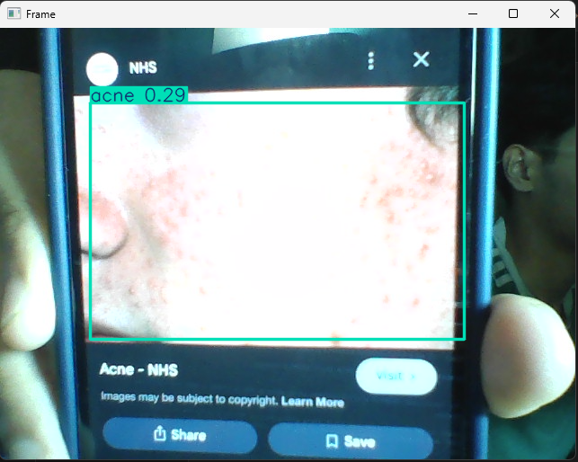

# Skin Disease Detection using Machine Learning

## Using YOLO, Roboflow and Python

This project is my learning and building process to train datasets from Roboflow with yolov8n model. It is a machine learning model that will help ease your process. 
Here's what I have achieved :

  * Finding 5 good datasets from Roboflow and how to implement in training
  * Train machine learning model using 1000+ image datasets to achieve accuracy
  * How to setup environment for machine learning in VSCode

## Model Output Example

Below is a sample prediction

